# 🗺️ Mapamigo


**Mapamigo** é um sistema de cadastro de contatos geolocalizados. Desenvolvido com foco em praticidade e modernidade, ele permite registrar informações detalhadas de pessoas e visualizá-las em um mapa interativo com a API do Google Maps.

Este é um projeto de estudo e teste técnico para a empresa UEX.

## ✨ Funcionalidades

* 👩🏻‍💻 Autenticação com Login e Senha
* 📍 Cadastro de contatos com:

  * Nome, CPF, telefone
  * Endereço completo via CEP (com preenchimento automático)
  * Posição geográfica (latitude/longitude via Google Maps)
* 🗂️ Listagem e edição de contatos
* 🗑️ Exclusão com confirmação via modal
* 🗺️ Visualização de localização no mapa (Google Maps)
* 💾 Persistência local com `LocalStorage` (simulando uma API)
* ⚡ Requisições otimizadas com SWR

## 🛠️ Tecnologias Utilizadas

* **React** + **TypeScript** + **Vite**
* **ViaCEP API**
* **Google Maps JavaScript API**
* **CSS Modules**
* **Web Components - Material Design 3**

## 📦 Instalação

1. Clone o repositório:

```bash
git clone https://github.com/seu-usuario/mapamigo.git
cd mapamigo
```

2. Instale as dependências:

```bash
npm install
```

3. Crie um arquivo .env na raiz do projeto com sua chave da API do Google Maps:

```bash
VITE_GOOGLE_MAPS_API_KEY=YOUR_GOOGLE_MAPS_API_KEY
```

4. Inicie o servidor de desenvolvimento:

```bash
npm run dev
```
O projeto estará disponível em: http://localhost:3000 e abrirá automáticamente no seu navegador principal.

## 📁 Estrutura de Pastas

```bash
src/
├── assets/               
├── components/
│   ├── common/           
│   └── mwc/              
├── config/               
│   ├── routes/           
│   └── styles/          
├── hooks/                
├── services/             
├── utils/                
├── view/
│   ├── auth/           
│   └── dashboard/                 
│   └── not-found/                 
└── main.tsx                      
```

## 💻 Telas

| 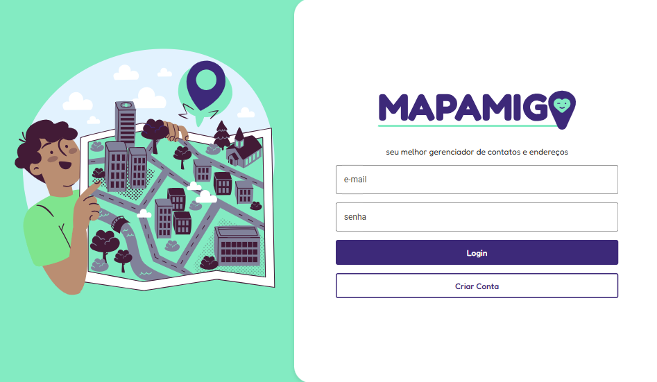 | 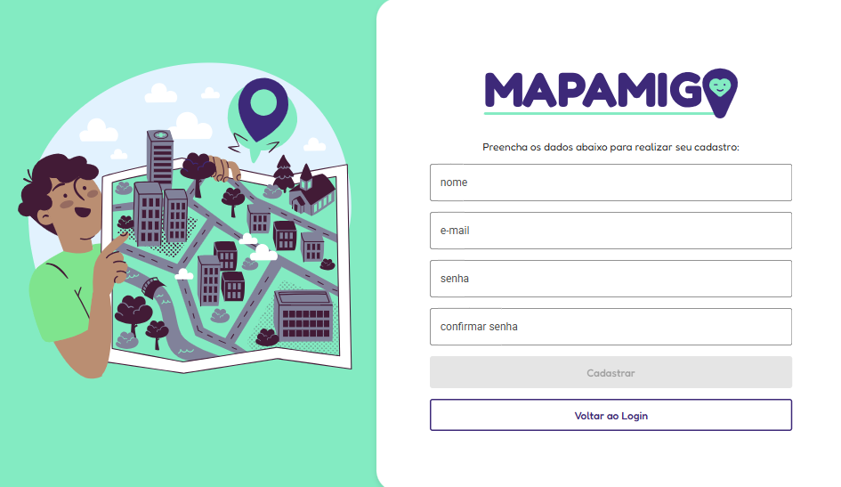 | 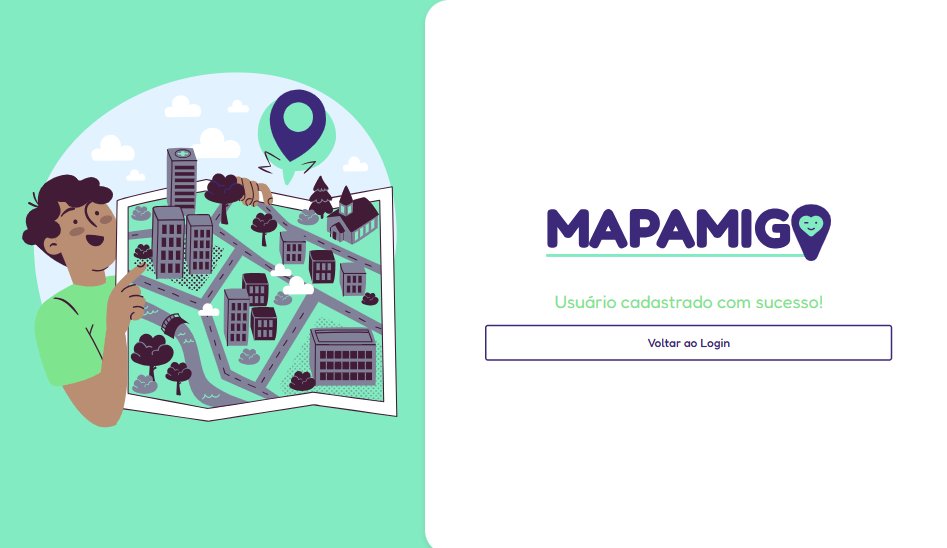
|:--:|:--:| :--:
| Login | Cadastro | Cadastro com Sucesso

| 
|:--:
| Responsividade das telas de Login e Cadastro

| 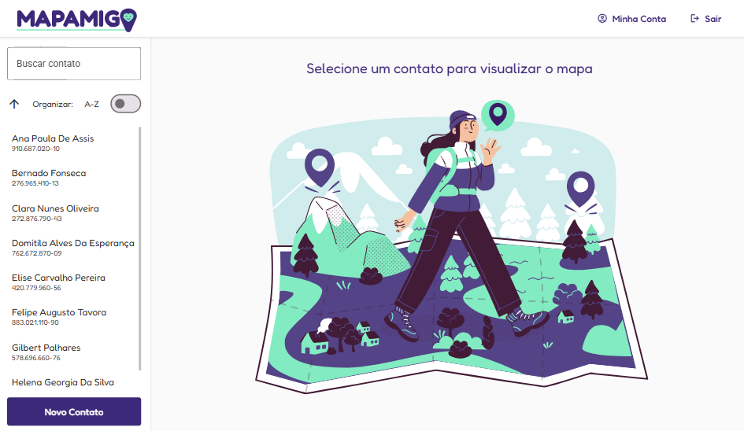
|:--:
| Painel Principal

| 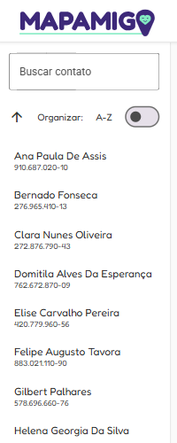 | 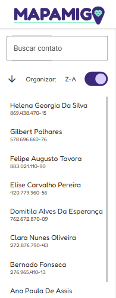 | 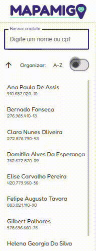
|:--:|:--:|:--:
| Lista de Contatos | Ordenação Alfanumérica | Ordenação e Pesquisa

| 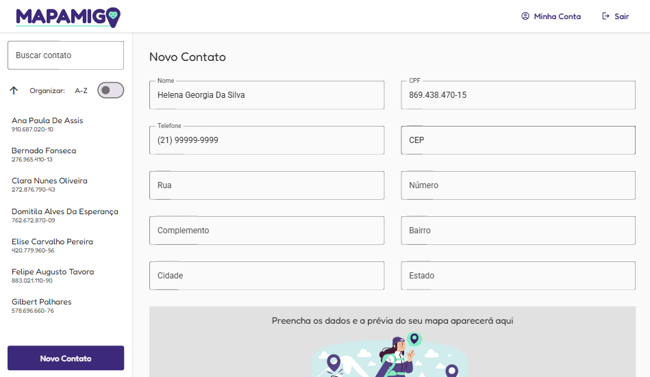 | 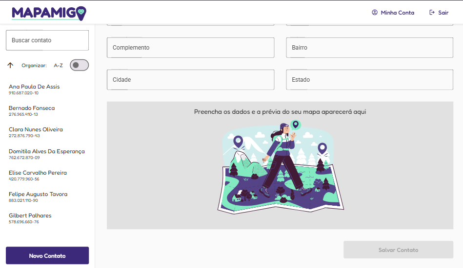
|:--:|:--:
| Criar Contato | Placeholder do Mapa

| 
|:--:
| Autocomplete de CEP (ViaCEP) e Pin do Mapa (Google Maps API)

| 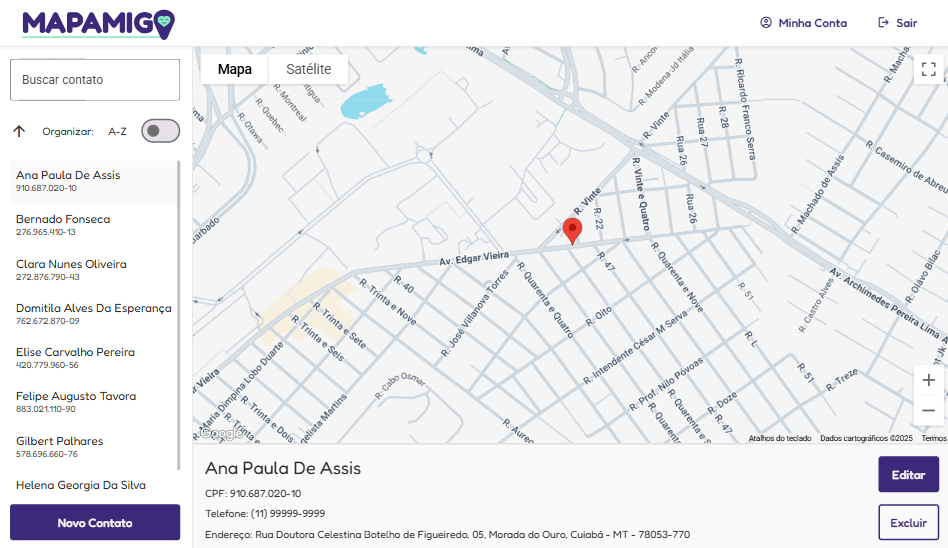
|:--:
| Detalhamento do Contato

| 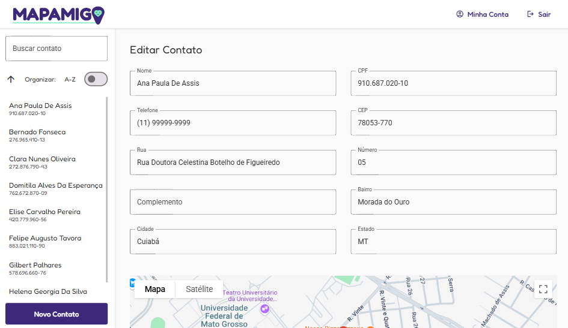 | 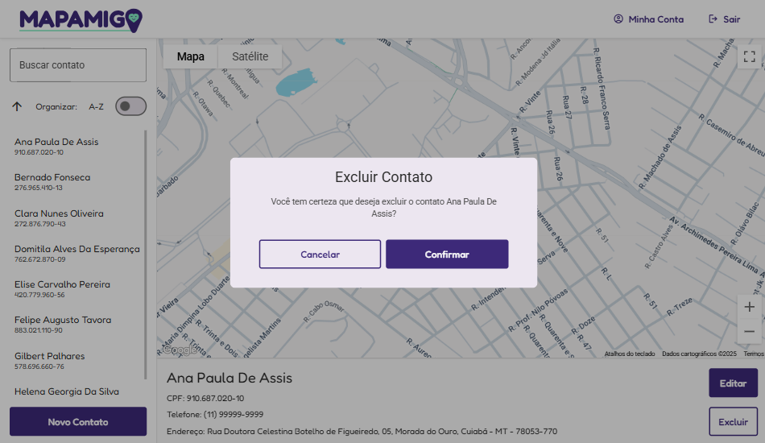
|:--:|:--:
| Editar Contato | Deletar Contato

| 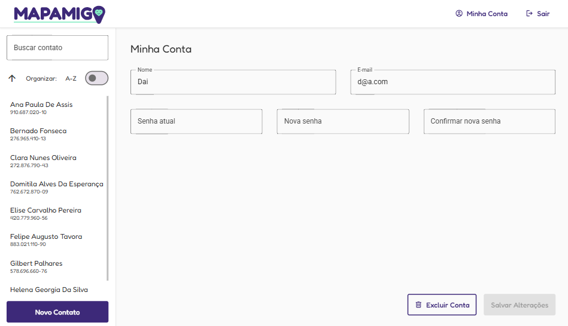 | 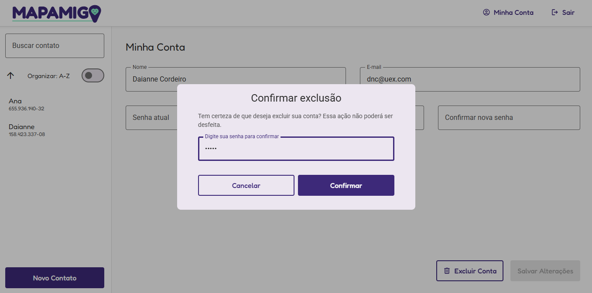
|:--:|:--:
| Editar Conta | Deletar Conta

| 
|:--:
| Responsividade do Painel Principal

| 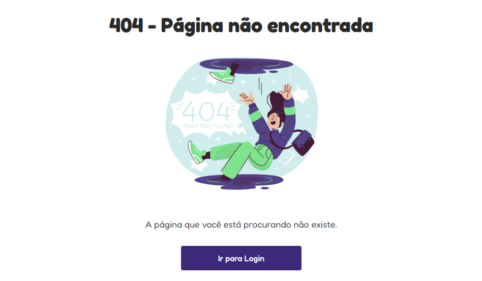
|:--:
| Tela de Erro 404

## 🙋‍♀️ Autora

Feito com 💖 por [Daianne Cordeiro](https://www.linkedin.com/in/daiannecordeiro/) — Desenvolvedora Web e UI/UX Designer.  
🖋️ Logotipo: Autoria própria  
🎨 Ilustrações: [Freepik](https://www.freepik.com)
